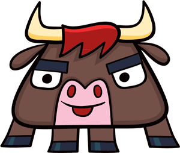

toro: Synchronization primitives for Tornado coroutines
=======================================================

.. getting the caption italicized with a hyperlink in it requires some RST hackage

*Toro logo by* |musho|_

.. _musho: http://whimsyload.com

.. |musho| replace:: *Musho Rodney Alan Greenblat*

The Wait / Notify Pattern
-------------------------

E.g. Condition.wait(callback, timeout)

Sometimes you get a value telling you what happened, other times there's
no change of state, other times you need to check the original object to
see what happened

.. todo:: fix that inconsistency?!

E.g. Condition.notify(callback), optionally resuming after waiters are
awakened

Contents
--------
.. toctree::
    examples/index
    classes
    faq

